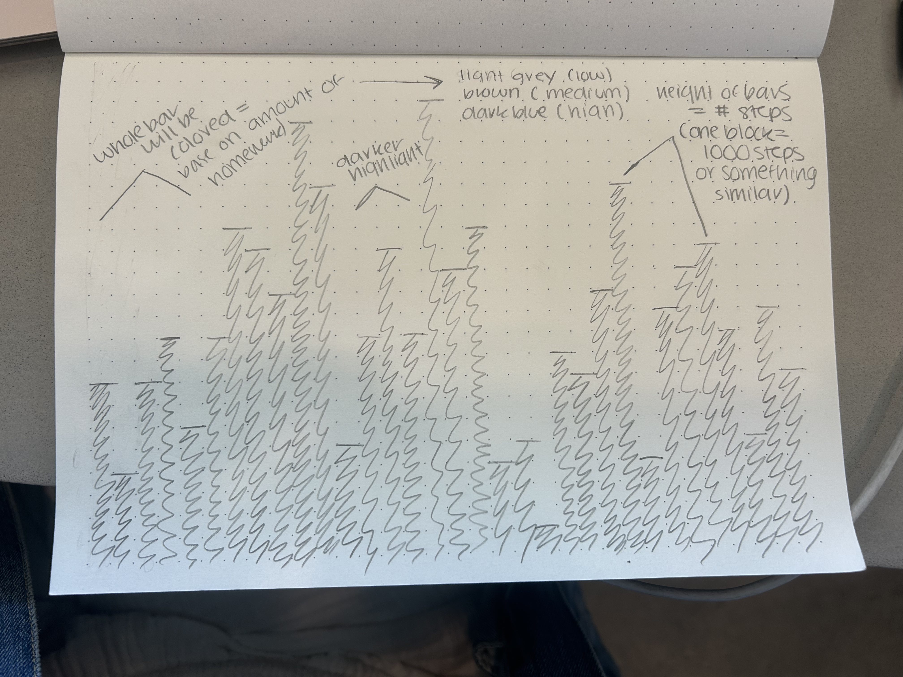
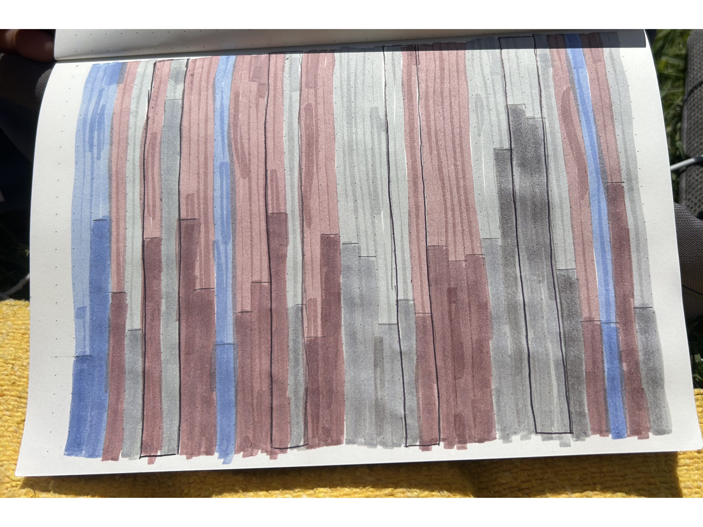
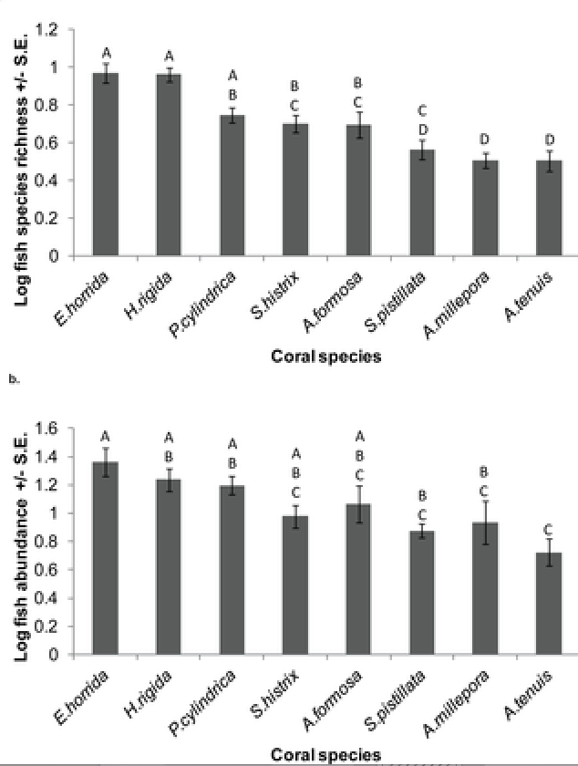

# Part 1. Homework Set Up

```{r}
#| label: loading-in-packages-and-data
#| message: FALSE


# loading in packages
library(tidyverse) # loading in tidyverse 
library(janitor) # loading in janitor 
library(here) # loading in here for file/folder organization
library(readxl) # loading in readxl
library(ggeffects) # loading in ggeffects 

# reading in and storing data as object "kelp"
kelp <- read_csv(here("data", "temp-kelp.csv")) # using here package
# reading in and storing personal data as object "personal"
my_data <- read_csv(here("data","personal-data.csv")) # using here package
```

# Part 2. Problems 

## Problem 1. Giant kelp fronds

### a. An appropriate test

In our study, we are trying to measure the strength of the relationship between two variables (ocean temperature and giant kelp frond elongation rate). In order to test the strength of this relationship, we should use a Pearson’s product-moment correlation and a Spearman’s rank correlation. Pearson's correlation test is the parametric version of the test, while Spearman's rank correlation is the non-parametric version that measures the correlation between ranks (rather than continuous variables).

### b. Create a visualization

```{r}
#| label: generating-linear-regression-model 

# generating the visualization
# base layer is ggplot 
ggplot(data = kelp, # data from kelp data set
       mapping = aes(x = temp_c, # x-axis = temp 
                     y = kelp_elong)) + # y-axis = growth rate 
  # first layer: geom_point 
  geom_point(size = 3,# changing point size 
             fill = "darkgreen", # adding data points in the color green
             alpha = 0.4, # making points opaque 
             shape = 21) + # point shape = circles 
  # labeling x- and y-axes ( x = temp, y = elongation rate)
  labs(x = "Temperature (°C)", # x = "Temperature (°C)"
       y = expression("Giant Kelp Frond Elongation Rate (cm day"^-1*")")) + 
  # changing theme to be different than he default 
  theme_minimal()
```

### c. Check your assumptions and run your test

#### Checking Assumptions 
```{r}
#| label: creating-a-QQ-plot-to-check-normality 
# base layer: gg-plot 
ggplot(data = kelp, # using kelp data frame
       # y-axis is kelp elongation rate (g) 
       mapping = aes(sample = kelp_elong)) + 
  # first layer: QQ reference line 
  geom_qq_line(color = "lightgreen") + # coloring the line
  # second layer: adding qq points 
  geom_qq()
```
My tests check the assumptions of a Pearson's correlation test (linear relationship between variables, variables are continuous, variables are normally distributed, and there independent observations), and the assumptions of Spearman's  correlation test (monotonic relationship between variables (unidirectional), and that there are independent observations). In my tests, I checked the assumptions of normality and linearity between variables, the data collected in this study did contain independent observations and variables are continuous. According to the QQ plot, the data are roughly normal, as the points follow the reference line comparing sample quantiles to theoretical (normal) quantiles, with only slight variation on the tails, however the center of the data tightly follow the reference line. This satisfies the assumption of normality for the Pearson correlation test. Finally, according the the scatter plot generated in part 1b, the data points follow a linear trajectory, and all points follow a clear unidirectional pattern, which satisfies the assumption of linearity for Pearson's correlation and the assumption of a monotonic relationship between variables for Spearman's correlation. 

#### Running the Test 
```{r}
#| label: running-pearsons

# running a correlation test 
# formula: (data frame$response, data frame$predictor)
cor.test(kelp$kelp_elong, kelp$temp_c, 
         method = "pearson") # type of test: pearson(normal residuals from QQ)
```

### d. Results communication

To evaluate the strength of the relationship between temperature and giant kelp frond elongation rate, I used a Pearson’s product-moment correlation because the data meets the assumptions of normality (as shown by the QQ plot), we are observing a linear relationship between two continuous variables, and there are independent observations. We found a moderate negative relationship between ocean temperature and Giant Kelp Frond elongation rate (Pearson’s r = -0.688, 95% CI [-0.8359665, -0.4460157], t(30) = -5.189, p < 0.001, $\alpha$ = 0.05).

### e. Test implications

Our tests suggest that as ocean temperature increases, the growth rate of Giant Kelp decreases. In regards to Giant Kelp health and prosperity, it is important to continue to monitor these populations in warmer water conditions to understand how rising global ocean temperature is affecting the Giant Kelp. Expanding research on temperature implications on the species, along with possible intervention strategies such as removal into colder waters can be explored in order to accommodate these species who are being negatively affected, in order to accurately inform conservation efforts.

### f. Double check your own work.

```{r}
#| label: running-spearmans-correlation-test 

# running the other correlation test 
# formula: (data frame$response, data frame$predictor)
cor.test(kelp$kelp_elong, kelp$temp_c, 
         method = "spearman") # type of test: spearman rank correlation
```

The two tests would have led me to the same conclusion, which was to reject the null hypothesis and infer that there is a moderate negative correlation between ocean temperature and Giant Kelp Frond elongation rate (Spearman $\rho$ = -0.689, S = 9216.1, p < 0.001, $\alpha$ = 0.05). Despite gathering the same conclusion and results, the two tests are different in what they are comparing. The Pearson’s product-moment correlation compares continuous variables and is the parametric version of a correlation test and a Spearman’s rank correlation compares ranks and is the non-parametric version of a correlation test. 

## Problem 2. Personal data

### a. Updating your visualizations

#### Weekend vs. Weekday Step Count Plot 

```{r}
#| label: visualizing-day-end-steps

# cleaning data first 
my_data_clean <- my_data |> 
  # cleaning column names 
  clean_names() |> 
  select(weekday_or_weekend,  #selecting 1st column of interest
         step_count) # selecting next column of interest
  
# base layer: ggplot 
ggplot(data = my_data_clean, 
       mapping = aes(x = weekday_or_weekend, # x-axis = category (weekend/day)
                     y = step_count, # y-axis is step count
                     color = weekday_or_weekend)) + # assign category colors 
  # first layer: boxplot
  geom_boxplot() +
  # second layer: jitter plot
  geom_jitter(height = 0, # making sure points don't move along y-axis
              width = 0.2) + # narrowing width of jitter
  # labeling x-axis, y-axis, and adding a title
  labs(x = "Weekday or Weekend", 
       y = "Daily Step Count", 
       title = "Number of Steps Taken differs on Weekday vs. Weekend",
       subtitle = "2026-05-20") +   
  # changing the theme to differ from default 
  theme_minimal() + 
  # assigning colors based on category 
  scale_color_manual(values = c("Weekday" = "#FFD166", 
                                "Weekend" = "lightblue")) + 
  # removing the legend
  theme(legend.position = "none")

```

#### Daily High Temperature vs. Step Count 
```{r}
#| label: another-plot 
# cleaning data first 
my_data_clean2 <- my_data |> 
  clean_names() |> # cleaning column names
  select(step_count, #selecting 1st column of interest
         high_temperature_o_f) # selecting next column of interest

# fitting the linear model to generate the ribbon + linear line 
my_data_model <- lm(
  step_count ~ high_temperature_o_f, # formula: steps as a function of temp
  data = my_data_clean2) # data from the kelp data set 

# generating predictor values for the linear model + ribbon 
my_data_preds <- ggpredict(
  my_data_model,     # model object
  terms = "high_temperature_o_f")  # predictor (in quotation marks)

# generating the plot 
ggplot(data = my_data_clean2, # selecting the data frame
       mapping = aes(x = high_temperature_o_f, # x-axis is step count
                     y = step_count, # y-axis is the day's high temperature
                     )) +  
  # first layer: geom_point
  geom_point(color = "#E84855", # adding colored visual data points
             size = 3) + # increaisng size of point 
  # second layer: ribbon representing confidence interval
  # using predictions data frame
  geom_ribbon(data = my_data_preds, # data from predicted data set 
              aes(x = x, # x = x in the data set
                  y = predicted, # y = y in the data set
                  ymin = conf.low, # min y point on ribbon set by CI
                  ymax = conf.high), # max y point on ribbon set by CI
                  alpha = 0.1, # opaqueness of the ribbon
                  fill = "pink3") + # changing ribbon color 
  # third layer: line representing model predictions
  # using predictions data frame
  geom_line(data = my_data_preds, # data from predicted data set 
            aes(x = x, # x = x in the data set
                y = predicted)) + # y = y in the data set
  # relabel x- and y-axes, legend title (still want title?)
  labs(x = "Daily High Temperature (°F)",
       y = "Daily Step Count",
       title = "Daily Step Counts Vary with the Daily High Temperature",
       subtitle = "2026-05-20") +
  # custom themes
  theme_light()
```

### b. Captions

#### Caption for "Number of Steps Taken differs on Weekday vs. Weekend"

**Figure 1. Number of steps taken differs on Weekday versus weekend.** Small circular points represent the total number of steps recorded on given weekday (yellow points) or weekend (blue points) from 2026-04-21 to 2026-05-20. Box plots represent median number of steps taken. The box itself represents the interquartile range, the horizontal line in the center represents the median number of steps taken on each day type, and the whiskers extend to the 1.5 x the IQR, while anything outside that range is an outlier. Data collected by Mila Matich from 2026-04-21 to 2026-05-20.

#### Caption for "Daily Step Counts Vary with the Daily High Temperature"

**Figure 2. Daily step count slightly varies with the Daily High Temperature.** Red dots represents the number of steps taken under a certain daily high temperature. Pink ribbon represents the 95% confidence interval, and the black line represents the line of best fit. Data collected by Mila Matich from 2026-04-21 to 2026-05-20

## Problem 3. Affective visualization

### a. Describe in words what an affective visualization could look like for your personal data.

For my personal data, an affective visualization could be a bar like visualization where each line would represent a day. The color of the bar would be determined by my stress or the amount of homework that I have each day (where high is dark blue, medium is brown, and low is light gray), then darkly shaded in is the height of the bar that represents how many steps I took that day. There will hopefully be a gradient showing the number of steps and how stressed I have been, and maybe a relationship you can see across the two. I can also add and additional layer where the outlined bars represent weekends, to add in my comparison of weekend and weekday. 

### b. Create a sketch (on paper) of your idea.



### c. Make a draft of your visualization.



### d. Write an artist statement.

My piece shows how my step count differs each day depending on how much homework I have each day. The height of the darker bar represents my step count, while the color of the line itself represents one day and the amount of homework I had that day, where light gray is low (less than 4 assignments), brown is medium (4-7 assignments), and dark navy is high (more than 7 assignments). This project has inspiration from Lorraine Woodruff-Long’s warming strips quilt along with the blankets people make to keep track of their mood, however in this case I overlay visualizations to represent my step count along with my daily homework amounts to make show a relationship between the two. I plan to recreate this piece using paint and a canvas rather than just markers on a small piece of paper, and displays at least 40 days of data, which in turn leads to painting 40 lines.  

### e. Prep your materials to share in class.

[View Slides](https://docs.google.com/presentation/d/1gBSKbgazp7y5gV4DWkFhraboy0ph_QNkMgZzGLjpKVg/edit?usp=sharing)

## Problem 4. Statistical critique

### a. Revisit and summarize

The author is addressing the relative importance of differing coral species in fostering fish communities, and evaluating whether sampling scale or coral colony size affected the fish's relationship with the habitat. In order to answer this question, the author is running tests to determine how the coral structures affect the relative fish abundance and diversity in the community. The test that I have selected to give a statistical critique on was the ANOVA. In this case, the response variables were fish species richness and total abundance, and the predictor variable in both cases is coral species.

#### Fish abundance and Species Richness Figures


### b. Visual clarity

The authors visually represent their statistics through their y-axis labels which clearly indicates that the bars represent the mean abundance or richness +/- the standard error (which is also shown in the figure with error bars overlapping the bars). These labels are in logical positions, and the graph does not show any underlying data or model predictions. Additionally, they show the results of the statistical tests using A.B,C, which denotes whether there is statistical difference between groups (which was determined by the ANOVA they ran). Bars with shared letters indicate no significant difference in both plots, while bars without shared letters indicate a significant difference in the variable described on the y-axis. 

### c. Aesthetic clarity

I believe the authors did a good job is handling visual clutter as there is not a lot of clutter on the figure pages (ie. no grid lines and no unnecessary tick marks). That being said, they have a good data:ink ratio, where there is enough ink to accurately describe the relationships that are being described, and do not use too much to over complicate the graphs. In my eyes, it is a very basic, minimal visual interpretation of the data and labels are only included when necessary. 

### d. Recommendations

One large recommendation I have is to make the data bars a different color than the error bars. At first glance, the error bars are hard to see and blend in with the data bars. Additionally, changing the font size to be slightly smaller than the figure and balancing out the text to figure ratio may be more visually pleasing and easier to read. Lastly, I would remove the letters about each graph and leave the statistical interpretation to the results section, or develop another way to show which groups have a statistical difference. At first glance, the letters are hard to interpret and adds to the visual clutter when it can be just described in the written portion of the paper. 


